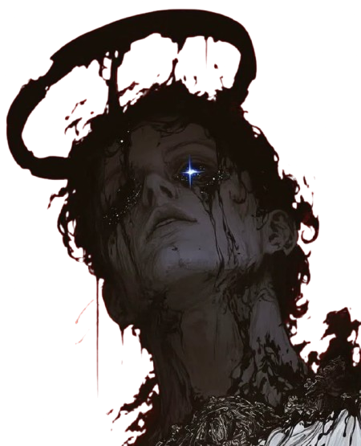

Notice that three of the images (`Tool1`, `Tool2`, and `Tool3`) were saved as **JPEGs** with black backgrounds rather than transparent **PNGs**. JPEG files do not support transparency, so any removed background will automatically fill with solid black or white when saved as a JPEG.

To use these cutouts dynamically over dark backgrounds or text, make sure you download or export them strictly as **`.png`** files (like `Tool4`).

---

## 1. How the "Text-Behind-Subject" Effect Works

The dramatic depth effect—where huge text sits *behind* the subject while the subject pops out into the foreground—is created by **3-layer CSS positioning**:

1. **Layer 1 (Bottom):** Deep dark canvas background (plus optional tech grids or scanlines).
2. **Layer 2 (Middle):** Giant brutalist typography set to absolute positioning with low opacity or stark white/red coloring.
3. **Layer 3 (Top):** The transparent PNG subject cutout (`z-index: 2`) aligned over the text.

```
 [ Layer 3: Cutout PNG ]  ---> (Top / Subject)
 [ Layer 2: Big Text  ]  ---> (Middle / "OBSCURE" or "RECON")
 [ Layer 1: Background]  ---> (Bottom / Grid or Solid #0a0a0a)

```

---

## 2. Code Implementation: Brutalist Tool Card

Here is a ready-to-use HTML and CSS snippet demonstrating how to create an interactive tool card using this exact layout:

### HTML

```html
<div class="tool-card">
  <!-- Layer 1: Background HUD / Grid -->
  <div class="card-bg"></div>

  <!-- Layer 2: Huge Background Text -->
  <div class="bg-text">SEARCH</div>

  <!-- Layer 3: Subject Cutout Image -->
  

  <!-- Layer 4: Interactive Tool Details & CTA -->
  <div class="card-info">
    <span class="tool-id">[ TOOL_01 ]</span>
    <h3 class="tool-title">Breach Scanner</h3>
    <p class="tool-desc">Scan public leak databases for exposed credentials.</p>
    <a href="#" class="tool-btn">LAUNCH MODULE &rarr;</a>
  </div>
</div>

```

### CSS

```css
:root {
  --bg-dark: #0a0a0a;
  --accent-red: #d01212;
  --text-white: #f0f0f0;
}

.tool-card {
  position: relative;
  width: 320px;
  height: 480px;
  background-color: var(--bg-dark);
  border: 1px solid #222;
  overflow: hidden;
  display: flex;
  flex-direction: column;
  justify-content: space-between;
  padding: 20px;
  transition: border-color 0.3s ease, transform 0.3s ease;
}

/* Hover effect on card */
.tool-card:hover {
  border-color: var(--accent-red);
  transform: translateY(-5px);
}

/* Layer 2: Massive Background Typography */
.bg-text {
  position: absolute;
  top: 15%;
  left: 50%;
  transform: translateX(-50%);
  font-family: 'Impact', 'Arial Black', sans-serif;
  font-size: 5rem;
  font-weight: 900;
  color: rgba(255, 255, 255, 0.08); /* Low opacity for depth */
  letter-spacing: 4px;
  z-index: 1;
  pointer-events: none;
  white-space: nowrap;
}

/* Layer 3: Cutout Image Pop Effect */
.subject-img {
  position: absolute;
  top: 10px;
  left: 50%;
  transform: translateX(-50%) scale(1);
  height: 320px;
  object-fit: contain;
  z-index: 2; /* Sits in front of the text */
  transition: transform 0.4s cubic-bezier(0.16, 1, 0.3, 1), filter 0.3s;
  filter: drop-shadow(0 10px 15px rgba(0,0,0,0.8));
}

.tool-card:hover .subject-img {
  transform: translateX(-50%) scale(1.08); /* Pops slightly on hover */
  filter: drop-shadow(0 0 15px rgba(208, 18, 18, 0.4)); /* Subtle red glow */
}

/* Layer 4: Tool Information */
.card-info {
  position: relative;
  z-index: 3;
  margin-top: auto;
  background: linear-gradient(180deg, transparent 0%, rgba(10,10,10,0.95) 40%);
  padding-top: 20px;
}

.tool-id {
  font-family: monospace;
  font-size: 0.75rem;
  color: var(--accent-red);
}

.tool-title {
  font-family: 'UnifrakturMaguntina', 'Chomsky', serif, sans-serif; /* Gothic font */
  font-size: 1.8rem;
  color: var(--text-white);
  margin: 5px 0;
}

.tool-desc {
  font-size: 0.85rem;
  color: #888;
  margin-bottom: 15px;
}

.tool-btn {
  display: inline-block;
  color: var(--text-white);
  font-family: monospace;
  font-size: 0.8rem;
  text-decoration: none;
  border: 1px solid #333;
  padding: 8px 12px;
  transition: all 0.2s;
}

.tool-btn:hover {
  background-color: var(--accent-red);
  border-color: var(--accent-red);
}

```

---

## 3. Mapping Images to OSINT Dashboard Modules

To give your dashboard a cohesive visual hierarchy, assign each character cutout to a dedicated category:

| Image Asset | Aesthetic Vibe | Suggested Tool Category |
| --- | --- | --- |
| **`Tool1`** *(Gold/Black Crown & Halo)* | High Authority / Guardian | **Domain & IP Recon** (Network footprinting, DNS records) |
| **`Tool2`** *(Blindfolded Silver Crown)* | Obscurity / Privacy | **Credential & Breach Checker** (Dark web leaks, compromised passwords) |
| **`Tool3`** *(Venetian Mask & Silk)* | Identity / Alias | **Social Footprint Analysis** (Username enumeration, social profiles) |
| **`Tool4`** *(Inked Halo / Astral)* | Data / Deep Scan | **Metadata Extractor** (EXIF data, document metadata) |

---

### Key Tips for File Formats

1. Convert `Tool1`, `Tool2`, and `Tool3` back to `.png` with transparent backgrounds so the black square box doesn't obscure the background text or borders.
2. If the `remove.bg` free downloads look pixelated on full-screen displays, consider using image upscalers or vectorizing the outline for clean rendering.